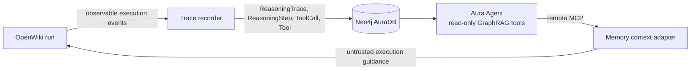

# OpenWiki graph reasoning memory demo

This proof of concept turns observable [OpenWiki](https://github.com/langchain-ai/openwiki) execution activity into the reasoning-memory portion of the [Neo4j Agent Memory](https://github.com/neo4j-labs/agent-memory) graph model. Traces are written directly to Neo4j AuraDB. A read-only Aura Agent then exposes that experience through MCP so a later OpenWiki run can reuse successful action sequences and avoid observed failure patterns.

The boundary is intentionally narrow: this project writes reasoning memory only. It does not ingest conversations, messages, entities, facts, or preferences.



## What the POC includes

- A recorder for both OpenWiki's current public `onEvent` contract and the higher-fidelity raw LangGraph stream.
- A Neo4j driver-backed, atomic, idempotent reasoning-trace store.
- A reasoning-only schema and full-text retrieval index.
- Three read-only Aura Agent Cypher Template tools.
- A Streamable HTTP MCP client with cached Aura machine-to-machine tokens.
- A code-mode-compatible preflight adapter that adds retrieved memory to an OpenWiki task as clearly delimited, untrusted context.
- A fail-open run-capture wrapper and a small, checked-in patch for OpenWiki 0.3.3 that exposes raw chunks and snapshots `_plan.md` before cleanup.
- CLI commands for capture-log replay, schema setup, ingestion, memory queries, code-mode task augmentation, and token minting.

For faithful upstream capture—including tool results, errors, subagent namespaces, and OpenWiki's temporary `_plan.md`—a small OpenWiki stream hook is still required. See [OpenWiki integration](docs/openwiki-integration.md).

## Reasoning-only graph boundary

Only these labels and relationships are created:

```text
(:ReasoningTrace)-[:HAS_STEP {order}]->(:ReasoningStep)
(:ReasoningStep)-[:USES_TOOL]->(:ToolCall)
(:ToolCall)-[:INSTANCE_OF]->(:Tool)
```

The shape follows Neo4j Agent Memory's reasoning model, including JSON-encoded metadata, arguments, and results. This project deliberately has no code or schema for `Conversation`, `Message`, `Entity`, `Fact`, or `Preference`. OpenWiki may continue to use its own SQLite checkpointer; that state is not copied into AuraDB.

## Prerequisites

- Node.js 22 or newer.
- An AuraDB instance and its Bolt URI, username, and password.
- Aura Agent and Generative AI Assistance enabled for the Aura organization.
- Tool authentication enabled for the target project.
- Project-admin access to create an Aura Agent.
- [`neo4j-cli`](https://neo4j.sh/) for Aura and schema setup.
- `jq` for `scripts/create-aura-agent.sh`.

External Aura Agents incur usage charges. Aura Agent interactions currently route through GCP `europe-west1` in Belgium; account for that in data-residency decisions. See the [current Aura Agent documentation](https://neo4j.com/docs/aura/aura-agent/).

## Install

```sh
npm install
cp .env.example .env
```

Populate the direct AuraDB connection used for trace writes:

```dotenv
NEO4J_URI=neo4j+s://your-instance.databases.neo4j.io
NEO4J_USERNAME=neo4j
NEO4J_PASSWORD=replace-me
NEO4J_DATABASE=neo4j
```

Do not commit `.env` or put credentials in connector JSON.

## Set up Aura with neo4j-cli

Install the CLI from [neo4j.sh](https://neo4j.sh/):

```sh
curl -sSfL https://neo4j.sh/install.sh | bash
```

Register Aura API credentials, find the organization and project, and select a default workspace:

```sh
neo4j-cli credential aura-client add \
  --name openwiki-aura \
  --client-id <AURA_API_CLIENT_ID> \
  --client-secret <AURA_API_CLIENT_SECRET> \
  --rw

neo4j-cli aura organization list --format toon
neo4j-cli aura project list --organization-id <ORGANIZATION_ID> --format toon
neo4j-cli aura workspace use <ORGANIZATION_ID>/<PROJECT_ID> --rw
neo4j-cli aura instance list --format toon
```

Aura API credentials manage cloud resources; they are not the Aura Agent & MCP credentials used by the runtime MCP client.

Optionally store the database connection for schema inspection with `neo4j-cli`:

```sh
neo4j-cli credential dbms add \
  --name reasoning-aura \
  --uri 'neo4j+s://your-instance.databases.neo4j.io' \
  --username neo4j \
  --password '<AURA_DB_PASSWORD>' \
  --rw

neo4j-cli query --credential reasoning-aura :schema --format toon
```

Create only the reasoning-memory constraints and indexes. The helper uses `neo4j-cli`; select the stored DBMS credential through `NEO4J_CREDENTIAL`:

```sh
export NEO4J_CREDENTIAL=reasoning-aura
./scripts/apply-reasoning-schema.sh
```

The TypeScript driver path, using the `NEO4J_*` values in `.env`, is:

```sh
npm run schema
```

## Run and ingest a sample trace

Translate the checked-in deterministic capture log and print the resulting reasoning trace. This is a dry run and does not connect to Neo4j:

```sh
npm run demo
```

To translate and persist the default capture log, ensuring the schema first:

```sh
npm run ingest
```

You can supply another capture log, or combine inspection and ingestion:

```sh
npm run ingest -- path/to/openwiki-capture.json
npm run demo -- path/to/openwiki-capture.json --ingest
```

The input format is demonstrated in [`examples/openwiki-run.json`](examples/openwiki-run.json): trace metadata plus ordered `public_event`, `raw_chunk`, and `plan_snapshot` entries and a final run status. Writes are atomic and use the caller's trace ID plus deterministic step IDs and trace/namespace-scoped tool-call IDs, so replaying the same capture updates it instead of creating a duplicate.

## Create the Aura Agent

The schema command creates the `reasoning_memory_search` full-text index used by the supplied Aura Agent tools. Inspect the graph before creating the agent:

```sh
neo4j-cli query --credential reasoning-aura :schema --format toon
```

Create the read-only agent from the checked-in prompt and tool definitions:

```sh
export AURA_DBID=<AURA_INSTANCE_ID>
./scripts/create-aura-agent.sh
```

The script uses:

- [`config/aura-agent-system-prompt.txt`](config/aura-agent-system-prompt.txt)
- [`config/aura-agent-tools.json`](config/aura-agent-tools.json)

It creates an enabled, external agent with MCP enabled. Record the returned agent ID. The remote endpoint has this form:

```text
https://mcp.neo4j.io/agent?project_id=<PROJECT_ID>&agent_id=<AGENT_ID>
```

You can also verify the agent through `neo4j-cli`:

```sh
neo4j-cli aura agent invoke <AGENT_ID> \
  --input 'Recall successful traces for documenting authentication' \
  --rw \
  --format json
```

## Configure machine-to-machine MCP access

In Aura Console, create a client credential under **Account settings → Client credentials → Aura Agent & MCP**, scoped to the agent. This is distinct from a general Aura API credential.

Add the endpoint and credentials to `.env`:

```dotenv
AURA_AGENT_MCP_URL=https://mcp.neo4j.io/agent?project_id=<PROJECT_ID>&agent_id=<AGENT_ID>
AURA_AGENT_MCP_CLIENT_ID=replace-me
AURA_AGENT_MCP_CLIENT_SECRET=replace-me
# Set this only if tools/list is ambiguous:
AURA_AGENT_MCP_TOOL=
```

Mint a token to verify the credential exchange:

```sh
npm run mint-token
```

The command prints the sensitive short-lived token itself to stdout and a warning to stderr; it does not print expiry metadata or populate another process's cache. The runtime client posts a `client_credentials` grant to `https://mcp.neo4j.io/oauth/token` with audience `https://agent-mcp.neo4j.io`, then caches the returned token through its advertised `expires_in` window. Neo4j documents a limit of 15 token requests per hour per client ID, so do not mint once per MCP request.

A pre-minted short-lived token can be supplied instead:

```dotenv
AURA_AGENT_MCP_ACCESS_TOKEN=replace-me
```

## Query memory

```sh
npm run query-memory -- 'What prior execution patterns help document authentication?'
```

The client initializes an MCP session, calls `tools/list`, selects the configured or unambiguous query tool, and sends the question through `tools/call`.

For OpenWiki code mode, generate a preflight-augmented task:

```sh
npm run augment-task -- 'Document the authentication architecture'
```

The same behavior is available through `augmentOpenWikiTaskWithReasoningMemory()`. Pass its `augmentedTask` to OpenWiki. Recalled text is capped at 16,000 characters, JSON-string encoded, has tag delimiters neutralized, and is enclosed in an `openwiki_reasoning_memory` block explicitly marked as untrusted historical data.

OpenWiki 0.3.x exposes generic connector tools only in personal mode. Copying [`config/openwiki-custom-mcp.example.json`](config/openwiki-custom-mcp.example.json) to `~/.openwiki/connectors/custom-mcp/config.json` therefore works in personal mode, but does not by itself make the connector available to repository/code mode. The integration guide covers the preflight workaround and the preferred dedicated-tool patch.

## CLI reference

| Command | Purpose |
| --- | --- |
| `npm run demo -- [capture.json] [--ingest]` | Translate a capture log and print the trace; write it only with `--ingest`. |
| `npm run schema` | Create the reasoning-only constraints, indexes, and full-text index in AuraDB. |
| `npm run ingest -- [capture.json]` | Translate and persist a capture log; defaults to `examples/openwiki-run.json`. |
| `npm run query-memory -- '<question>'` | Query the external Aura Agent over MCP. |
| `npm run augment-task -- '<task>'` | Print a task augmented with bounded, untrusted recalled memory. |
| `npm run mint-token` | Mint and print a sensitive short-lived Aura Agent MCP token. |
| `npm run test:unit` | Run isolated recorder, capture-log, memory-context, and MCP-client tests. |
| `npm run test:integration` | Run CLI/store/capture integration tests; the live Neo4j case skips without test credentials. |
| `npm run test:e2e` | Build and exercise the CLI as a child process against a local OAuth + MCP test server. |
| `npm run test:coverage` | Enforce the repository-wide coverage gates. |
| `npm run check` | Type-check, run every test layer and coverage gate, and build the project. |

## Verify the boundary

Run the local checks:

```sh
npm run check
```

Run the database integration test locally by pointing it at a disposable Neo4j
database. The test creates uniquely named reasoning nodes and removes them when
it finishes:

```sh
TEST_NEO4J_URI=bolt://127.0.0.1:7687 \
TEST_NEO4J_USERNAME=neo4j \
TEST_NEO4J_PASSWORD=test-password \
npm run test:integration:neo4j
```

The [GitHub Actions workflow](.github/workflows/ci.yml) runs the suite on Node
22 and 24, starts a Neo4j 5 service for the live schema/ingestion test, uploads
the coverage report, and checks the OpenWiki hook patch against its pinned
upstream revision. No Aura credentials are required by CI; the E2E test uses a
loopback-only OAuth and Streamable HTTP MCP server.

Inspect counts:

```sh
NEO4J_CREDENTIAL=reasoning-aura ./scripts/reasoning-summary.sh
```

Confirm that no short- or long-term memory labels were written:

```sh
neo4j-cli query --credential reasoning-aura \
  'MATCH (n) RETURN labels(n) AS labels, count(*) AS count ORDER BY labels'
```

After ingesting a sample, the only expected labels are `ReasoningTrace`, `ReasoningStep`, `ToolCall`, and `Tool`.

## Security model

- The POC records observable execution behavior, not private hidden chain-of-thought. Tool-step `thought` values remain unset. The only populated `thought` is an explicit `_plan.md` snapshot, marked observable and stored as the first step with action `plan`.
- Credential-like keys are recursively redacted and captured tool inputs, results, errors, actions, plans, and final outcomes are bounded before persistence. The task string is supplied by the host integration; summarize or sanitize it first when needed.
- Retrieved memory is untrusted data. The adapter caps it, JSON-string encodes it, neutralizes tag delimiters, and tells OpenWiki never to follow instructions embedded in stored tasks, arguments, results, or observations.
- Aura Agent tools are read-only. Trace ingestion uses the separate direct Bolt connection.
- Keep client secrets and tokens in environment-backed secret storage. Never place them directly in the custom MCP JSON.
- A memory-write or memory-read outage should not be allowed to corrupt an OpenWiki run; production wiring should fail open and optionally spool a sanitized trace locally for retry.

## More detail

See [docs/openwiki-integration.md](docs/openwiki-integration.md) for the upstream capture seam, plan-file lifecycle, exact M2M request, code-mode limitation, recommended patch, and end-to-end verification checklist.

Primary references:

- [OpenWiki source](https://github.com/langchain-ai/openwiki)
- [LangGraph JavaScript streaming](https://docs.langchain.com/oss/javascript/langgraph/streaming)
- [Neo4j Agent Memory reasoning API](https://github.com/neo4j-labs/agent-memory/blob/main/docs/modules/ROOT/pages/reference/api/reasoning.adoc)
- [Aura Agent](https://neo4j.com/docs/aura/aura-agent/)
- [neo4j-cli](https://neo4j.sh/)
